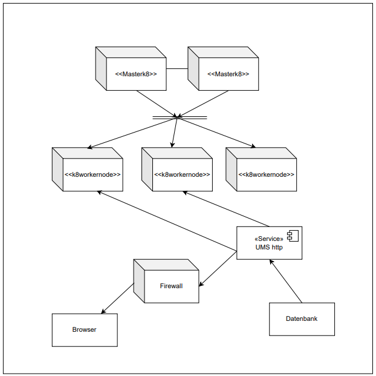

# 

**About arc42**

arc42, the template for documentation of software and system
architecture.

Template Version 8.2 EN. (based upon AsciiDoc version), January 2023

Created, maintained and © by Dr. Peter Hruschka, Dr. Gernot Starke and
contributors. See <https://arc42.org>.

This version of the template contains some help and explanations. It is
used for familiarization with arc42 and the understanding of the
concepts. For documentation of your own system you use better the
*plain* version.

# Introduction and Goals

The following document gives a detailed overview of goals, features, functionalities, architectural decisions, etc. 
Also assumptions as well as reasonings for certain decisions are documented here for future reference. 

In the end, the delivered product should:
-   make communication between students and the faculty as well as its employees easier
-   be easy to use without any training for all parties
-   drastically lower the organizational overhead
-   secure private data
-   enable data-driven decision making through reporting and analytics

## Requirements Overview

 
 **Dashboard with relevant information**
 
 

 
To make strategic decisions, information and data is crucial. Therefore, the university management application needs to make those not just available, but also displays them in an adequate manner. 

 
**Course and curriculum management**

The organisation of the courses and the curriculum represent two crucial parts of day-to-day life in a university. The software needs to support the employees here and automate as much process steps as possible.

 
**User authentification**

The university must handle the personal data of the students as well as of employees. To make sure, that no one can access semiboneless account and data user authentication need to be implemented.

 
**Billing and payment management**

This application supports the faculty and students whenever they must interact with each other. Therefore, also a billing and payment management system will be implemented.

 
**Reports and Analytics**

Defined reports will be generated periodically. Also certain tools for further analysing the collected data will be accessible, to make (for example) additional dashboards possible.

## Quality Goals

**Usability**

The main goal of this applications is making the day-to-day life of students as well as employees easier. Therefore, it must not be necessary to have a training to be able to work with the university management tool. Every time person who has to fulfil a task which involves this application should be able to it without any detailed instructions.

**Correctness**

This tool works with personal data of many individuals. Therefore, it is required by law to handle that information carefully. However, also data like grades, dates of tests as well as timetables are crucial for day-to-day life at a university and needs to be accessible and always correct.

**Interoperability**

A university is in contact with several other organisations like the state, other universities and so on. These partnerships often include some type of exchange of data. To support this process and also make the organisation capable of connecting with further organisations interoperability has a central position in this project.

## Stakeholders

| Role/Name   | Contact        | Expectations       |
|-------------|----------------|--------------------|
| *Senior Lecturer/Jane Doe* | *j.doe@uni.at* | *Efficiency; Ease the workload* |
| *Student Rep./ Emily Chen* | *e.chen@uni.at* | *Proper User Experience; Ease the communication; Data protection* |
| *Financial Officer/Sarah Johnson* | *s.johnson@uni.at* | *Create revenue of subscription fees* |
| *Chief Information Officer/Michael Lee* | *m.lee@uni.at* | *Ease the protection of student and lecturer data* |

# Architecture Constraints

| Constraints   | Background and/or motivation  |
|-------------|----------------|
| *Programming Language* | *Developers can only code in Java and JavaScript* |
| *On-Premise Server* | *The University mandates that we shall used an On-Premise solution, not a Cloud-Solution* |
| *DSGVO* | *Data must be encrypted and stored in Europe* |
| *Cost* | *University has a very limited budget and fixated -> less flexibility.* |
| *Web-Application* | *The whole application is hosted in the Web* |

# System Scope and Context
## Business Context

**Student**

The students might will be the most frequent users of this application. This kind of users interacts most of the times by inserting information or looking something up.

**Accounting Software**

The currently used application for supporting the accounting process will be further used. Necessary information will be provided by the university management tool.

**Moodle**

Moodle is a crucial part when preparing for and working in the lectures. Also, the grading is handled here. Also, Moodle needs certain personal data of the students which is provided by the university application tool.

**Austia Student Database**

Universities are obliged by law to provide certain information of the students and the faculty.

**Webmail**

The university already has a tool for providing the students as well as the employees with an email address. This application will be further used and will be get needed personal data.

## Technical Context

There are three types of users, which interact with the system. Students and lectors each manage their own data and deal with the course management as well as an admin. The course management plays a crucial part in the system, by accepting or defining students, lecture, and the necessary rooms for a course. Also, attendance and grades management (which are important for the reporting) get information from the curse management. 

As already mentioned, is the admin crucial for creating a course with all its involved people and necessary facilities. Students and lectures are both needed for an exam, where later a grade is set and further provided to grades management. Also of course, it is important to track the attendance of a course and further transfer this data.

# Solution Strategy

**(easy) Deployment**

An easy deployment is crucial for this application, because there is just a short timeframe for setting it up and going life during summer. To successfully establish this SOA would be the preferred approach.

**Adaptive (regarding user feedback)**

Demand a priorities can change over time, especially when working with software. Due to that, the system must be able to be adapted. A system based on a SOA or MS approach would guarantee this.

**low maintenance cost**

When the university management tool is set up, it should take a minimum of time and cost to keep it running. This could be realised by an SOA or Monolithic approach.

Demands and priorities can change over time, especially when working with software. Due to that, the system must be able to be adapted. A system based on a SOA or MS approach would guarantee this.

**Conclusion**

Keeping the mentioned goals in mind an SOA architectural approach seems as the most promising one. The combination of being able to adapt and improving the system as well as low overhead seems like a perfect fit for this project.

# Building Block View

**Content**

The building block view shows the static decomposition of the system
into building blocks (modules, components, subsystems, classes,
interfaces, packages, libraries, frameworks, layers, partitions, tiers,
functions, macros, operations, data structures, …) as well as their
dependencies (relationships, associations, …)

This view is mandatory for every architecture documentation. In analogy
to a house this is the *floor plan*.

**Motivation**

Maintain an overview of your source code by making its structure
understandable through abstraction.

This allows you to communicate with your stakeholder on an abstract
level without disclosing implementation details.

**Form**

The building block view is a hierarchical collection of black boxes and
white boxes (see figure below) and their descriptions.

**Level 1** is the white box description of the overall system together
with black box descriptions of all contained building blocks.

**Level 2** zooms into some building blocks of level 1. Thus it contains
the white box description of selected building blocks of level 1,
together with black box descriptions of their internal building blocks.

**Level 3** zooms into selected building blocks of level 2, and so on.

See [Building Block View](https://docs.arc42.org/section-5/) in the
arc42 documentation.

## Whitebox Overall System

Here you describe the decomposition of the overall system using the
following white box template. It contains

-   an overview diagram

-   a motivation for the decomposition

-   black box descriptions of the contained building blocks. For these
    we offer you alternatives:

    -   use *one* table for a short and pragmatic overview of all
        contained building blocks and their interfaces

    -   use a list of black box descriptions of the building blocks
        according to the black box template (see below). Depending on
        your choice of tool this list could be sub-chapters (in text
        files), sub-pages (in a Wiki) or nested elements (in a modeling
        tool).

-   (optional:) important interfaces, that are not explained in the
    black box templates of a building block, but are very important for
    understanding the white box. Since there are so many ways to specify
    interfaces why do not provide a specific template for them. In the
    worst case you have to specify and describe syntax, semantics,
    protocols, error handling, restrictions, versions, qualities,
    necessary compatibilities and many things more. In the best case you
    will get away with examples or simple signatures.

***\Overview Diagram***

Motivation  
We decided on this decomposition because it allows that all courses are managed in one specific building block, which will be the most important building block. This block will access all the other blocks via internal interfaces. The users will just access this buidling block as well as a specificially designed buidling block for them (including the lector management for the lector and the student management for the student), all others including the user dashboard will be operated via the course management building block. 

Contained Building Blocks  

| **Name**         | **Responsibility** |
|------------------|--------------------|
| *\Course Management* |  *\The course management is responsible to manage the courses.*         |
| *\Faculty Management* |  *\The faculty management is responsible to provide the rooms for the course.*         |
| *\Student Management* |  *\The student management is respsonsible to collect and check the base data of the students.*         |
| *\Lector Management* |  *\The lector management is respsonsible to collect and check the base data of the lectors.*         |
| *\Attendance Management* |  *\The attendance management is responsible to track the attendance of the students due the entirety of the course.*         |
| *\Grades Management* |  *\The Grades Management is responsible to track and calculate the grades of the students for each course.*         |
| *\Reporting* |  *\The reporting is responsible to provide different reports on the attendance and grades of each course.*         |

If you use a list of black box descriptions then you fill in a separate
black box template for every important building block . Its headline is
the name of the black box.

### \Faculty Management
The faculty management is responsible to provide the rooms for the course as well as tracking the room situation.

### \Student Management
The student management is responsible to collect and check the base data of the students.

### \Lector Management
The lector management is respsonsible to collect and check the base data of the lectors.

### \Course Management
The course management is responsible to manage the courses. It is also responsible to manage the students, lectors and rooms assigned to this specific course.

### \Grades Management
The Grades Management is responsible to track and calculate the grades of the students for each course.

### \Attendance Management
The attendance management is responsible to track the attendance of the students due the entirety of the course.

### \Reporting
The reporting is responsible to provide different reports on the attendance and grades of each course.

## Level 2

### White Box *\Course Management*

The Course Management building block consists of three main functions:
- create Course
- hold Exam
- track Attendance

- track Attendance uses a direct interface to connect with the attendance management buidling block.

- hold exam uses a second function to communciate with the grades management.

- create Course communicates with three other building blocks (Lector Management, Faculty Management and Student Management)

  The main purpose of this block is to manage all the courses the university offers. Each course is created through accessing this buidling block.

## Level 3

Here you can specify the inner structure of (some) building blocks from
level 2 as white boxes.

When you need more detailed levels of your architecture please copy this
part of arc42 for additional levels.

### White Box \<\_building block x.1\_\>

Specifies the internal structure of *building block x.1*.

*\<white box template>*

### White Box \<\_building block x.2\_\>

*\<white box template>*

### White Box \<\_building block y.1\_\>

*\<white box template>*

# Runtime View

**Contents**

The runtime view describes concrete behavior and interactions of the
system’s building blocks in form of scenarios from the following areas:

-   important use cases or features: how do building blocks execute
    them?

-   interactions at critical external interfaces: how do building blocks
    cooperate with users and neighboring systems?

-   operation and administration: launch, start-up, stop

-   error and exception scenarios

Remark: The main criterion for the choice of possible scenarios
(sequences, workflows) is their **architectural relevance**. It is
**not** important to describe a large number of scenarios. You should
rather document a representative selection.

**Motivation**

You should understand how (instances of) building blocks of your system
perform their job and communicate at runtime. You will mainly capture
scenarios in your documentation to communicate your architecture to
stakeholders that are less willing or able to read and understand the
static models (building block view, deployment view).

**Form**

There are many notations for describing scenarios, e.g.

-   numbered list of steps (in natural language)

-   activity diagrams or flow charts

-   sequence diagrams

-   BPMN or EPCs (event process chains)

-   state machines

-   …

See [Runtime View](https://docs.arc42.org/section-6/) in the arc42
documentation.

## \Runtime Scenario 1: Create Course

-   In this runtime scenario there are four different building block instances involved (Student management, course management, facility management and lector management). As depicted in the graphic and shown in the building block diagram the scenario starts from the course management instance, which creates the base instance of a course, where students, rooms and lectors are assigned afterwards.
-   If at least one of the other building blocks reports a negative answer (eg due to too little registered students or no available room) the course is deleted and the scenario ends with a negative output.
-   If all of the other buidling blocks report a positive answer the course is saved and the scenario ends with a positive output.

## \<Runtime Scenario 2>

# Deployment View

**Content**

The deployment view describes:

1.  technical infrastructure used to execute your system, with
    infrastructure elements like geographical locations, environments,
    computers, processors, channels and net topologies as well as other
    infrastructure elements and

2.  mapping of (software) building blocks to that infrastructure
    elements.

Often systems are executed in different environments, e.g. development
environment, test environment, production environment. In such cases you
should document all relevant environments.

Especially document a deployment view if your software is executed as
distributed system with more than one computer, processor, server or
container or when you design and construct your own hardware processors
and chips.

From a software perspective it is sufficient to capture only those
elements of an infrastructure that are needed to show a deployment of
your building blocks. Hardware architects can go beyond that and
describe an infrastructure to any level of detail they need to capture.

**Motivation**

Software does not run without hardware. This underlying infrastructure
can and will influence a system and/or some cross-cutting concepts.
Therefore, there is a need to know the infrastructure.

Maybe a highest level deployment diagram is already contained in section
3.2. as technical context with your own infrastructure as ONE black box.
In this section one can zoom into this black box using additional
deployment diagrams:

-   UML offers deployment diagrams to express that view. Use it,
    probably with nested diagrams, when your infrastructure is more
    complex.

-   When your (hardware) stakeholders prefer other kinds of diagrams
    rather than a deployment diagram, let them use any kind that is able
    to show nodes and channels of the infrastructure.

See [Deployment View](https://docs.arc42.org/section-7/) in the arc42
documentation.

## Infrastructure Level 1

Describe (usually in a combination of diagrams, tables, and text):

-   distribution of a system to multiple locations, environments,
    computers, processors, .., as well as physical connections between
    them

-   important justifications or motivations for this deployment
    structure

-   quality and/or performance features of this infrastructure

-   mapping of software artifacts to elements of this infrastructure

For multiple environments or alternative deployments please copy and
adapt this section of arc42 for all relevant environments.

***\<Overview Diagram>***

Motivation  
Our idea was to build the Moodle-System around a handful of Nodes to distribute the load which can come in a system which needs to run permanently 24/7
and has a lot of users. For one this can mean unnecessary infrastructure elements, but for a reliable and flexible system it is sufficient. In this image we considered one database as an example with the interaction of Webservice and Firewall, but there can be more than one database if needed.

Quality and/or Performance Features  
1. Through two or more nodes the load can be distributed in a better way so the system doesn't overload
2. Keeping it more simple with the database and the Browser may prevent overcomplicating things

Mapping of Building Blocks to Infrastructure  
*\<description of the mapping>*

## Infrastructure Level 2

Here you can include the internal structure of (some) infrastructure
elements from level 1.

Please copy the structure from level 1 for each selected element.

### *\<Infrastructure Element 1>*

*\<diagram + explanation>*

### *\<Infrastructure Element 2>*

*\<diagram + explanation>*

…

### *\<Infrastructure Element n>*

*\<diagram + explanation>*

# Cross-cutting Concepts

**Content**

This section describes overall, principal regulations and solution ideas
that are relevant in multiple parts (= cross-cutting) of your system.
Such concepts are often related to multiple building blocks. They can
include many different topics, such as

-   models, especially domain models

-   architecture or design patterns

-   rules for using specific technology

-   principal, often technical decisions of an overarching (=
    cross-cutting) nature

-   implementation rules

**Motivation**

Concepts form the basis for *conceptual integrity* (consistency,
homogeneity) of the architecture. Thus, they are an important
contribution to achieve inner qualities of your system.

Some of these concepts cannot be assigned to individual building blocks,
e.g. security or safety.

**Form**

The form can be varied:

-   concept papers with any kind of structure

-   cross-cutting model excerpts or scenarios using notations of the
    architecture views

-   sample implementations, especially for technical concepts

-   reference to typical usage of standard frameworks (e.g. using
    Hibernate for object/relational mapping)

**Structure**

A potential (but not mandatory) structure for this section could be:

-   Domain concepts

-   User Experience concepts (UX)

-   Safety and security concepts

-   Architecture and design patterns

-   "Under-the-hood"

-   development concepts

-   operational concepts

Note: it might be difficult to assign individual concepts to one
specific topic on this list.

See [Concepts](https://docs.arc42.org/section-8/) in the arc42
documentation.

## *\<Concept 1>*

**Development concepts**
1. Agile
   Agile is an iterative and flexible approach to software development and project    
   management. It emphasizes collaboration, adaptability, and customer satisfaction. 
   Agile methodologies, such as Scrum or Kanban, promote regular reassessment and 
   adaptation of plans based on feedback throughout the development process.
   
2. TDD (Test Driven Development)
   Test-Driven Development (TDD) is a software development method where tests are 
   written before code. The process involves creating a failing test, writing the 
   minimal code to pass the test, and then refining the code while ensuring all tests 
   still pass. TDD promotes code quality, early bug detection, and serves as 
   documentation for software behavior.
   
## *\<Concept 2>*

**Architecture and design patterns**
1. SOA
   Service-Oriented Architecture (SOA) is a design approach that organizes software 
   into independent services communicating through defined interfaces, promoting 
   flexibility and reusability.
2. Seperation of three layers (Database, Application, Client)
   The separation of three layers  —  Database, Application, and Client—is a design  
   principle in software architecture.

   2.1 Database Layer:
   Manages data storage and retrieval.
   Stores and organizes information using a database system.

   2.2 Application Layer:
   Contains the business logic and core functionalities.
   Processes data from the database layer and prepares it for presentation.
   
   2.3 Client Layer:
   Represents the user interface and user interaction.
   Displays information to users and collects input.
   
## *\<Concept 3>*

**Safety and security concepts**

   Introduction of Encryption Software (for personal data)

# Architecture Decisions

**Contents**

Important, expensive, large scale or risky architecture decisions
including rationales. With "decisions" we mean selecting one alternative
based on given criteria.

Please use your judgement to decide whether an architectural decision
should be documented here in this central section or whether you better
document it locally (e.g. within the white box template of one building
block).

Avoid redundancy. Refer to section 4, where you already captured the
most important decisions of your architecture.

**Motivation**

Stakeholders of your system should be able to comprehend and retrace
your decisions.

**Form**

Various options:

-   ADR ([Documenting Architecture
    Decisions](https://cognitect.com/blog/2011/11/15/documenting-architecture-decisions))
    for every important decision

-   List or table, ordered by importance and consequences or:

-   more detailed in form of separate sections per decision

See [Architecture Decisions](https://docs.arc42.org/section-9/) in the
arc42 documentation. There you will find links and examples about ADR.

**Our Crosscutting decisions**

# Quality Requirements

**Content**

This section contains all quality requirements as quality tree with
scenarios. The most important ones have already been described in
section 1.2. (quality goals)

Here you can also capture quality requirements with lesser priority,
which will not create high risks when they are not fully achieved.

**Motivation**

Since quality requirements will have a lot of influence on architectural
decisions you should know for every stakeholder what is really important
to them, concrete and measurable.

See [Quality Requirements](https://docs.arc42.org/section-10/) in the
arc42 documentation.

## Quality Tree

**Content**

The quality tree (as defined in ATAM – Architecture Tradeoff Analysis
Method) with quality/evaluation scenarios as leafs.

**Motivation**

The tree structure with priorities provides an overview for a sometimes
large number of quality requirements.

**Form**

The quality tree is a high-level overview of the quality goals and
requirements:

-   tree-like refinement of the term "quality". Use "quality" or
    "usefulness" as a root

-   a mind map with quality categories as main branches

In any case the tree should include links to the scenarios of the
following section.

## Quality Scenarios

**Contents**

Concretization of (sometimes vague or implicit) quality requirements
using (quality) scenarios.

These scenarios describe what should happen when a stimulus arrives at
the system.

For architects, two kinds of scenarios are important:

-   Usage scenarios (also called application scenarios or use case
    scenarios) describe the system’s runtime reaction to a certain
    stimulus. This also includes scenarios that describe the system’s
    efficiency or performance. Example: The system reacts to a user’s
    request within one second.

-   Change scenarios describe a modification of the system or of its
    immediate environment. Example: Additional functionality is
    implemented or requirements for a quality attribute change.

**Motivation**

Scenarios make quality requirements concrete and allow to more easily
measure or decide whether they are fulfilled.

Especially when you want to assess your architecture using methods like
ATAM you need to describe your quality goals (from section 1.2) more
precisely down to a level of scenarios that can be discussed and
evaluated.

**Form**

Tabular or free form text.

# Risks and Technical Debts

**Attempt of stealing personal data**

In the last years criminal organisations regularly tried to steal personal data from companies and demand money in exchange to not make this information public. To reduce that risk, an external IT security company will periodically attempt this and give feedback for further improvements.

**DSGVO adaptation**

It is possible that the European parliament wants to make the rules for handling personal data stricter. Therefore, the application has to be adaptable regarding how this kind of information is stored and processed.

**"Quick Fixes" for features**

Due to hard deadlines, there might be a scenario, where certain features must be implemented rather quickly and so developers must trade fast developing against technical dept. However, this must be well documented, so later this dept can be fixed, when time is available.

# Glossary

**Contents**

The most important domain and technical terms that your stakeholders use
when discussing the system.

You can also see the glossary as source for translations if you work in
multi-language teams.

**Motivation**

You should clearly define your terms, so that all stakeholders

-   have an identical understanding of these terms

-   do not use synonyms and homonyms

A table with columns \<Term> and \<Definition>.

Potentially more columns in case you need translations.

See [Glossary](https://docs.arc42.org/section-12/) in the arc42
documentation.

| Term        | Definition        |
|-------------|-------------------|
| *\<Term-1>* | *\<definition-1>* |
| *\<Term-2>* | *\<definition-2>* |
